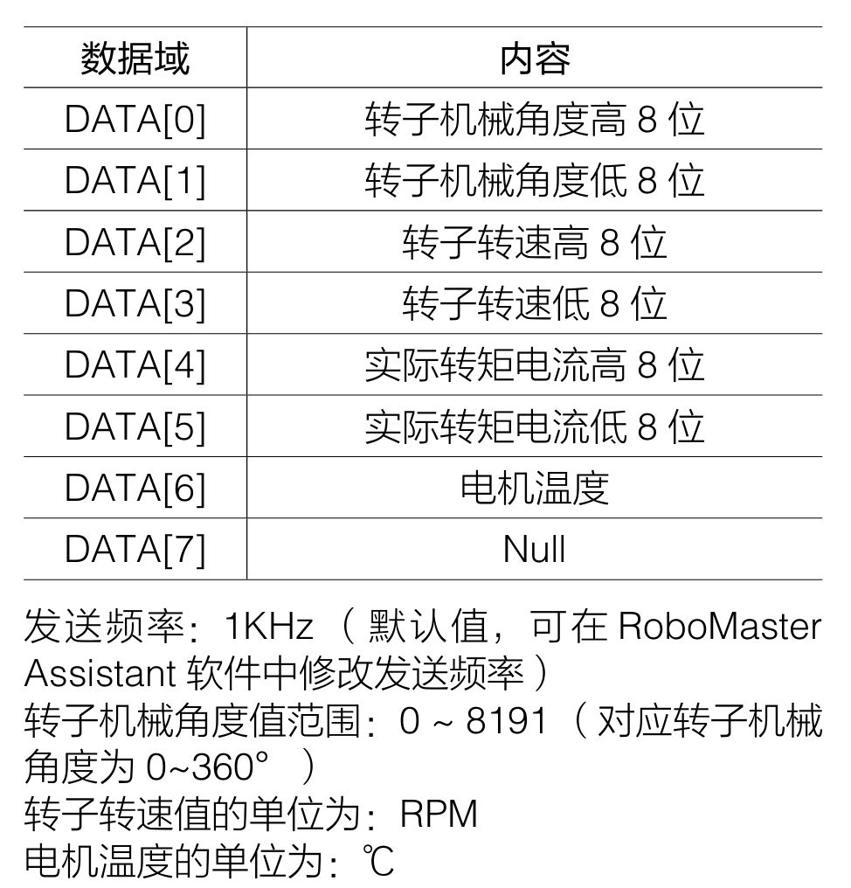

# 2.1.1 学习日志

## CAN通信配置

### 基本参数设置

CAN通信大部分的配置CubeMX已经准备好了，配置带宽为1Mbps，然后只需要配置过滤器以及收到报文后的处理函数即可。

### 报文接收

有RoboMaster官方文档可知。C620电调反馈的报文为标准帧，格式为数据帧，标识符为`0x200` + 电调ID，DLC为8个字节。

#### 过滤器配置

由于报文是多个ID，此处只用到的一种类型，因此选用32位掩码模式的过滤器。

设置ID高16位为`0x200 << 5`，低16位为`0x0000`，掩码高16位为`0x7F0 << 5`，低16位为`0x0000 | 0x02 | 0x04`。

这样就配置好了只接受标准帧格式的`0x20`开头的数据帧。

#### 数据解析



代码如下所示

```c
typedef struct
{
    uint8_t id;
    uint16_t angle;
    uint16_t speed;
    float current;
    uint8_t temperature;
} C620_Motor_Status_TypeDef;

float convert_raw_to_angle(uint16_t angle)
{
    const float SCALE_FACTOR = 360.0f / 8191.0f;
    return raw * SCALE_FACTOR;
}

float convert_raw_to_amps(int16_t raw)
{
    const float SCALE_FACTOR = 20.0f / 16384.0f;
    return raw * SCALE_FACTOR;
}

void C620_Motor_Status_Init(C620_Motor_Status_TypeDef *status, uint32_t stdId, uint8_t *data)
{
    status->id          = stdId & 0x00F;
    status->angle       = convert_raw_to_angle((data[0] << 8) | data[1]);
    status->speed       = (data[2] << 8) | data[3];
    status->current     = convert_raw_to_amps((data[4] << 8) | data[5]);
    status->temperature = data[6];
}
```

### 报文发送

根据官方文档，报文的接受使用了两个标识符，分别是`0x200`与`0x1FF`，分别控制1-4号与5-8号电调。

帧格式为标准帧的数据帧，DLC为8个字节，每个电调使用两个字节，分别为控制电流的高八位和低八位。

#### 数据解析

控制电流为两个字节，范围是`-16384~0~16384`，对应电调输出的转矩电流范围为`-20~0~20A`
